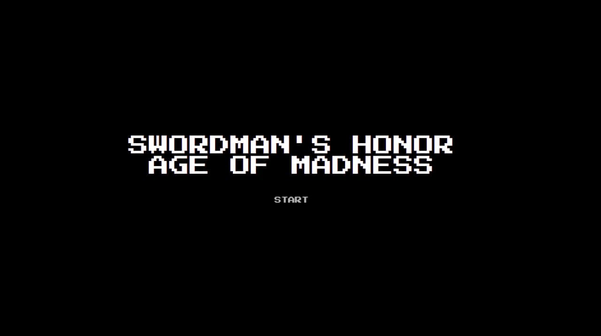
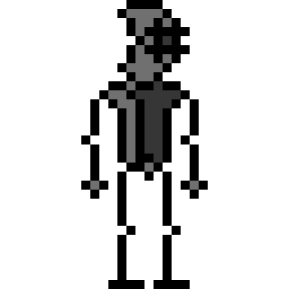
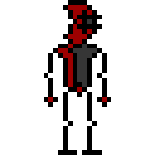
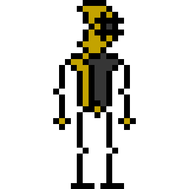
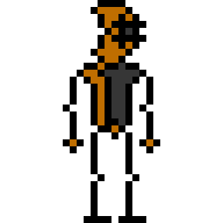
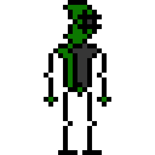
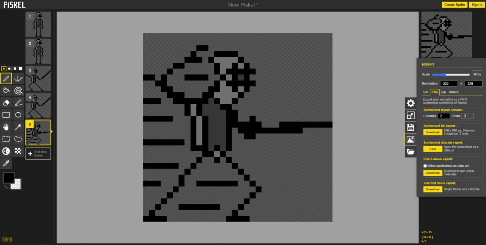

# SWORDMAN HONOR - AGE OF MADNESS

#### BOOTCAMP FIGHT GAME

https://vicenteaparicio.github.io/BootcampFightGame/

### Project details

On this project I had to create a web fight game with HTML, CSS3 and JAVASCRIPT. The project's brief ask for several fighters to choose, action hit/life function and ES6 Object coding.

- Start date: 10 May 2021
- Delivery date: 16 May 2021
- Dedicated time: <30 hours 

 ***
 
</img>
</img>
</img>
</img>
</img>
</img>

>Ave, Caesar, morituri te salutant.  -  Hail Cesar, those who are about to die salute you!

***

## Tech

- HTML5
- CSS3
- JAVASCRIPT
- PISKEL (pixel art web application)

This was an awesome project cause I had to challenge myself several times to add different kind of functions. Two days before delivery project I decided change the theme of my game, goig from a boxing game perspective to a swordman's fight perspective. 

***

## Pixel art with Piskel

>Pixel art is more alive than ever!

The graphic design of my game is pixel art. This kind of design remembers the old game ages. The new engines and workflow improve this art to a new and atractive level. Not my case, I am new with this art but some artists are really cool. 

You can try yourself here: https://www.piskelapp.com/

***

## Lo que me ha quedado por hacer
Mucho, mucho me ha quedado por hacer. Desde desarrollar un buen carrusel de los proyectos de diseño gráfico donde mostrar en secciones que se van desplegando las explicaciones de cada uno de ellos hasta añadir efectos de paralax para crear profundidad en la web. 

***

## ¿En qué debo mejorar?
En todo. Mi código sigue ensuciándose rápidamente con elementos innecesarios. A veces por querer abarcar más de lo que mis conocimientos son capaces de realizar. Me desvío muchas veces en problemas pequeños que me quitan mucho tiempo y dejo de lado partes más importantes que necesitan una buena mano de chapa y pintura. 