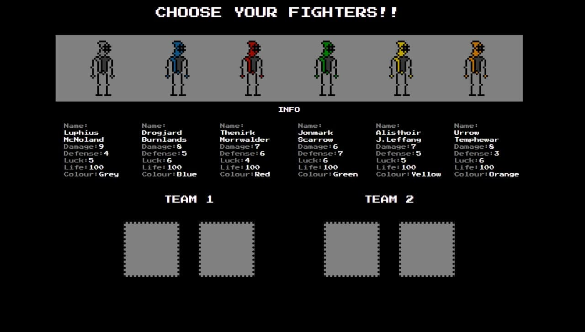
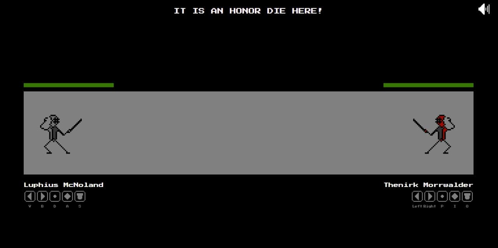

# SWORDMAN HONOR - AGE OF MADNESS

#### BOOTCAMP FIGHT GAME

https://vicenteaparicio.github.io/BootcampFightGame/

### Project details

On this project I had to create a web fight game with HTML, CSS3 and JAVASCRIPT. The project's brief ask for several fighters to choose, action hit/life function and ES6 Object coding.

- Start date: 10 May 2021
- Delivery date: 16 May 2021
- Dedicated time: <30 hours 

 ***
 
</img>
</img>
</img>
</img>
</img>
</img>

>Ave, Caesar, morituri te salutant.  -  Hail Cesar, those who are about to die salute you!

***

## Tech

- HTML5
- CSS3
- JAVASCRIPT
- PISKEL (pixel art web application)
- Audacity (audio editor)

This was an awesome project cause I had to challenge myself several times to add different kind of functions. Two days before delivery project I decided change the idea of my game: from a boxing game perspective to a swordman's fight perspective. That way I could work with different conditions and create an atractive game dynamic for gamers. 

***

## Pixel art with Piskel

>Pixel art is more alive than ever!

The graphic design of my game is pixel art. This kind of design remembers the old game ages. The new engines and workflow improve this art to a new and atractive level. Not my case, I am new with this art but some artists are really cool. 

You can try yourself here: https://www.piskelapp.com/

***

## What I left behind

The entire project was a race against clock. Only one week to develop a fight game from zero. That is the reason to set a MVP (minimun viable product) and try to reach it sooner as posible. This way you can deep into some details like a nice intro/ending animation. I had no time for that cause it has a lot of work but it is not really relevant for the brief project.

Stuff I left behind:
- Nice intro/ending game
- At least three different vs battles
- Control panel not in the fight screen
- Characters lore

***

## What I should do better?
On this project I would save a lot of time having the right idea of the game from begining. I swap the game base structure several times until I finally choose the definitive idea to work with two days before delivery the project. It is like fighting against myself every step cause the project vision is not clear. The moment I had a good vision about my project I worked faster than the rest of the days. Next time I will save first day entirely to create a good idea to help me to have an early nice vision of the project.